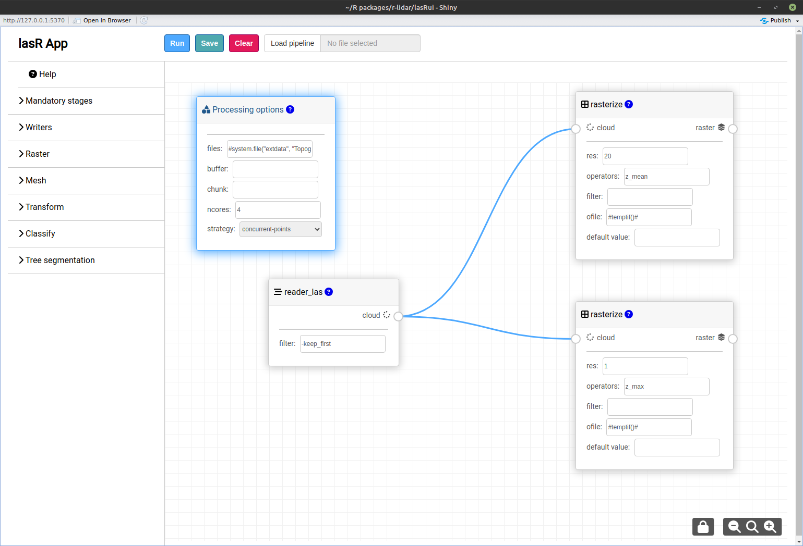

# lasRui


[](https://github.com/r-lidar/lasRui/actions/workflows/R-CMD-check.yaml)

> [!IMPORTANT]  
> This package is in a **very early experimental stage**. Regular backward-incompatible modifications will be made in the near future. Crashes of the R session are possible, and incorrect results may occur. It is public for curious people who want to provide feedback and will ultimately be added to [lasR](https://github.com/r-lidar/lasR).

`lasRui` is a Shiny application for the `lasR` package that allows building complex pipelines using [visual programming](https://bitspark.de/blog/what-is-visual-programming) by dragging and dropping stages in a web interface and connecting the boxes.

## Installation

```r
install.packages('lasRui', repos = c('https://r-lidar.r-universe.dev', 'https://cloud.r-project.org'))
```

## Features

- :heavy_check_mark: Drag, drop, and connect `lasR` stages. Currently, only a restricted number of stages are available to prevent users from building overly complex pipelines. As the software becomes more stable, we will add more stages until all `lasR` features are mapped into `lasRui`.
- :heavy_check_mark: Run the pipeline with a single click.
- :heavy_check_mark: Auto-completion of some inputs.
- :heavy_check_mark: Progress bar.
- :heavy_check_mark: Save your pipeline in a `json` file to reload it later.
- :negative_squared_cross_mark: Error handling is minimal. It is possible to connect stages incorrectly and populate inputs poorly.
- :negative_squared_cross_mark: Aborting the computation is not yet possible. There is a stop button, but it is not yet connected to any action.
- :negative_squared_cross_mark: Software ergonomics have room for improvement.


## Example

In the following example, we draw a pipeline where we (1) assign a collection of files to process, (2) create a `reader_las()` stage to read the point <kbd>cloud</kbd>, and (3) connect the <kbd>cloud</kbd> to two `rasterize()` stages to produce two rasters.

``` r
library(lasRui)
lasRui()
```



## Features

- Drag and drop stages from the side menu
- Connect stages organically; stages must be connected by similar icons/names
- Save pipeline to a file
- Load saved pipeline
- Progress bar

